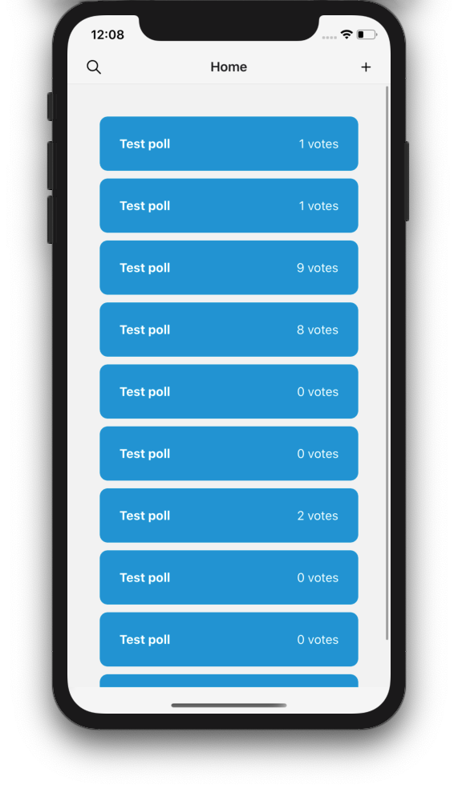
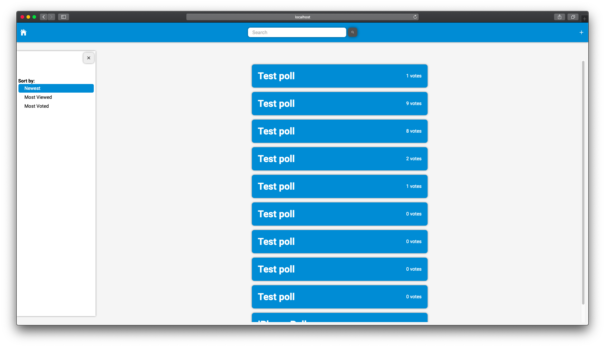

---

<h1 align="center">
Voting App
</h1>

  
  
  
  

  <a href="#project">Project</a>
  &nbsp;&nbsp;|&nbsp;&nbsp;
  <a href="#technologies">Technologies</a>
  &nbsp;&nbsp;|&nbsp;&nbsp;
  <a href="#how-to-run">How to Run</a>
  &nbsp;&nbsp;|&nbsp;&nbsp;
  <a href="#how-to-contribute">How to Contribute</a>
  &nbsp;&nbsp;|&nbsp;&nbsp;
  <a href="#license">License</a>

# Project

  
  

This is a project from the [App Ideas](https://github.com/florinpop17/app-ideas) repository.

It was made in 4 days, including the backend, frontend, and mobile.

# Technologies

This project was developed using the following technologies:

### Back End:
- [Node.js](https://nodejs.org/)
- [Express Js](https://expressjs.com/)
- [TypeORM](https://typeorm.io)

### Front End:
- [React](https://reactjs.org)
- [Create React App](https://create-react-app.dev/)

### Mobile:
- [React Native](https://reactnative.dev)
- [Expo SDK](https://expo.io)

# How to Run

### Requisites

- [Node.js](https://nodejs.org/)
- [npm](https://npmjs.com/)
- [Expo-CLI](https://expo.io)

## Back End

- Navigate to the backend directory `cd backend`.
- Install the dependencies `npm install`.
- Run the server using `npm start`.

## Front End

- Navigate to the frontend directory `cd frontend`.
- Install the dependencies `npm install`.
- Run the development server using `npm start`.

## Mobile

- Navigate to the mobile directory `cd mobile`.
- Install the dependencies `npm install`.
- Start Expo with `npm start`.
- Run the app on a device or emulator.

# How to Contribute

- Create a fork of this repository;
- Create a branch for your new feature: `git checkout -b my-new-feature`;
- Commit your changes: `git commit -m 'feat: My new feature'`;
- Push to your branch: `git push origin my-new-feature`;
- Make a pull request.

# License

This project is under MIT license. Take a look at the file [LICENSE](LICENSE.md) for more details.
